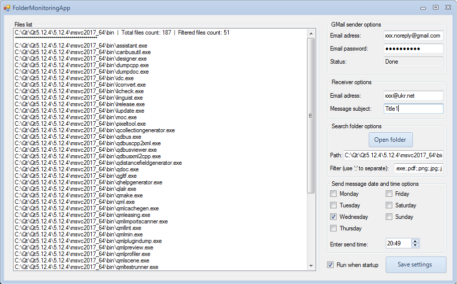

# FolderMonitoringApp
The program goes through all subfolders in a folder, including multilevel nesting. Determine which folder is not empty. Count the number of files in it. Files for monitoring: .pdf .png .jpg .jpeg .doc .docx .xls .xlsx .rtf .rar .zip. Record the path to a non-empty folder and the number of files in it, each launch is a separate log. Generate a letter that will contain a log. Send via smtp.gmail.com to the specified email.

 
